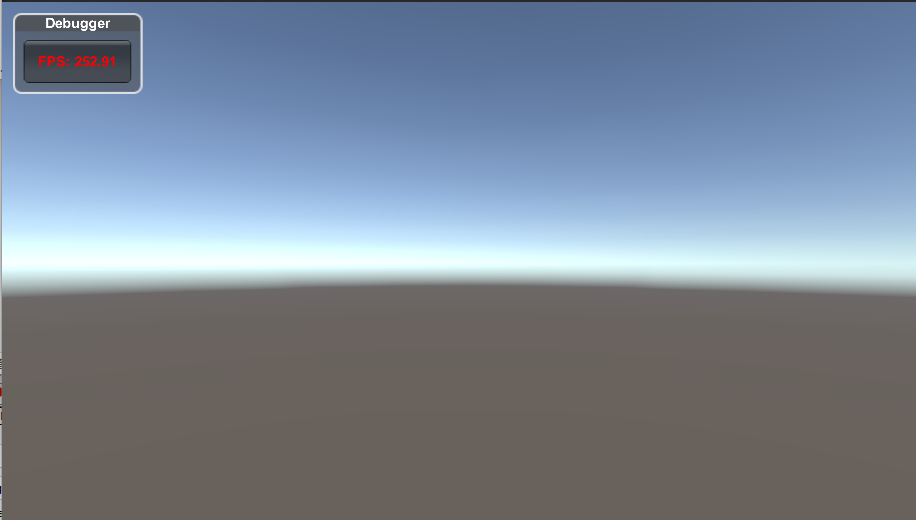
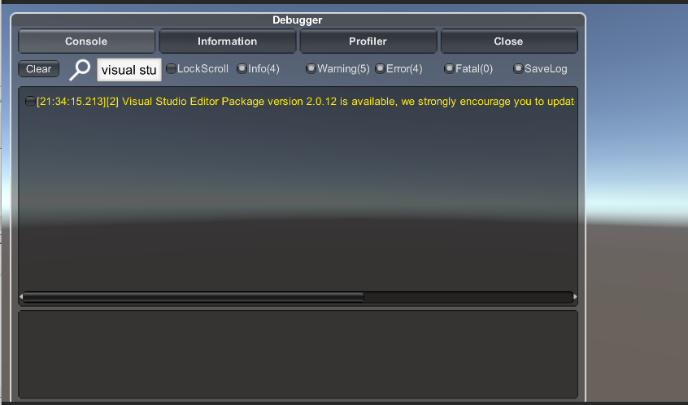
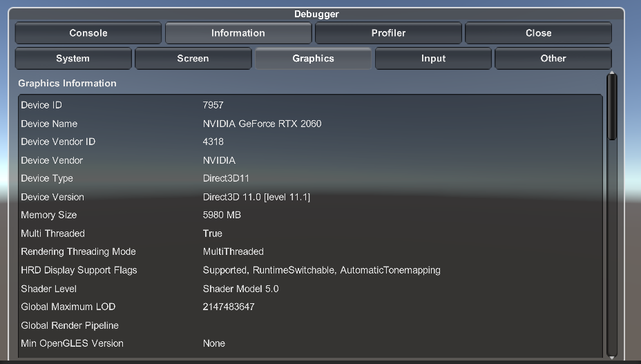
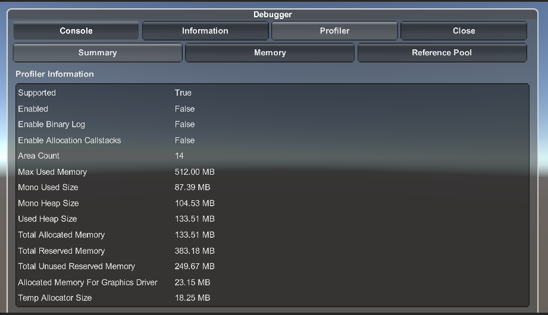

## Debugger: A powerful runtime debug tool for unity.
# [中文](https://github.com/FlameskyDexive/Debugger/blob/main/README_CN.md) 
# Debugger Functions
### - View logs, and copy to clipboard. 
### - Save logs to local txt files by toggle.
### - View the information of your machine, such as cpu/gpu. 
### - View basic profiler information, such as memory/resources, and support take a snapshop.
### - Auto resize on different resolutions. 
### - Search log by key word. 

## Todo:
### - Publish to unity package manager and Asset Store
### - Add GM API support

## 1. How to use
	git clone this project, and move it to Plugins folder of your project
	
## 2. Attach
	add Debugger Component to your MainCamera just fine. 

## references：
[A powerful unity client framework: GameFramework](https://github.com/EllanJiang/GameFramework)
